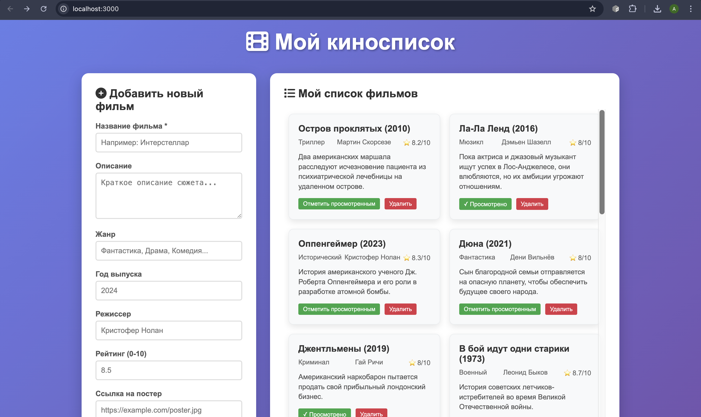
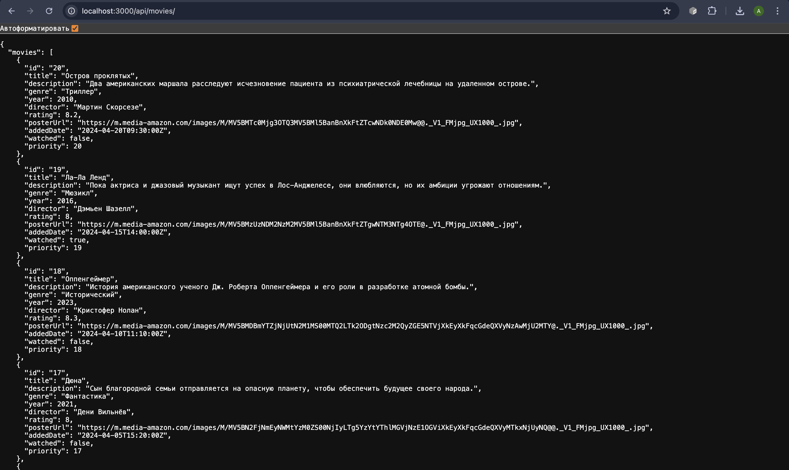
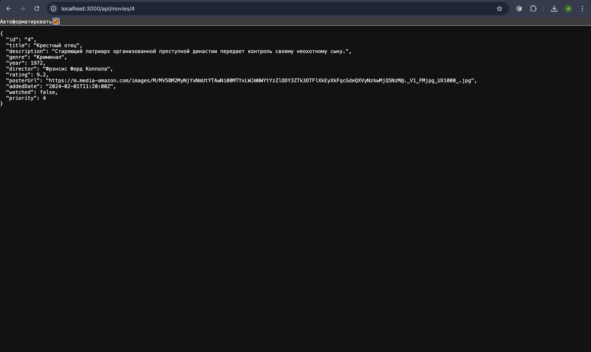

# Movie Watchlist API

API для управления списком фильмов "Хочу посмотреть" с веб-интерфейсом.

## Функциональность

- Добавление новых фильмов в список
- Обновление информации о фильмах
- Удаление фильмов из списка
- Минимальный адаптивный веб-интерфейс



- Пагинация и сортировка
- Логирование всех запросов





## Установка и запуск

```bash
git clone https://github.com/soalko/TIP_KR5_Soldatov.git
cd TIP_KR5_Soldatov
npm install
npm start